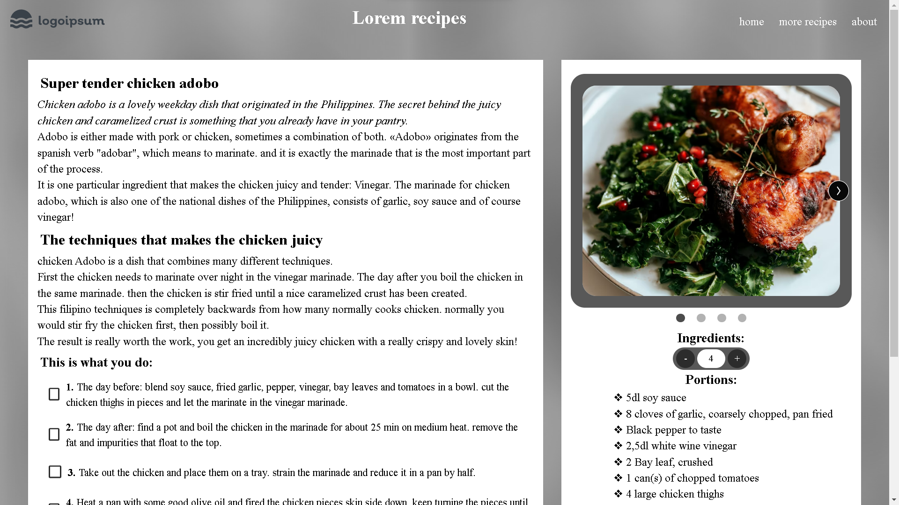

# Lorem-recipes

 

  
<h3 align="center">Lorem recepies</h3>

## Brief Overview

This project is a school task that focuses on the use of pseudo classes in web development. For the project i have taken it upon myself to challenge my skills by incorporating additional elements such as Javascript and Sass.

As part of the project, i have  designed a portion calculator for a recipe with specific constraints for the end user. This calculator was created using Javascript.

Additionally, the project includes an image carousel, which required a significant amount of Javascript coding to get the slides working and the navigation updated.
 
The project consists of two main pages: "pseudo.html" and "adobo.html". The first page is a small overview of a few pseudo classes, while the second page showcases the use of almost all of them.

  

### Built with

- [![JavaScript][javascript-shield]][js-url]
- [![HTML][html-shield]][html-url]
- [![SASS][sass-shield]][sass-url]

(<a href="#readme-top">back to top</a>)

(<a href="#readme-top">back to top</a>)
  

[javascript-shield]: https://img.shields.io/badge/JavaScript-F0DB4F?style=for-the-badge&logo=JavaScript&logoColor=black
[js-url]: https://www.ecma-international.org/publications-and-standards/standards/ecma-262/
[html-shield]: https://img.shields.io/badge/HTML-e34c26?style=for-the-badge&logo=HTML5&logoColor=white
[html-url]: https://html.spec.whatwg.org/multipage/
[sass-shield]: https://img.shields.io/badge/SASS-bf4080?style=for-the-badge&logo=SASS&logoColor=white
[sass-url]: https://sass-lang.com/
